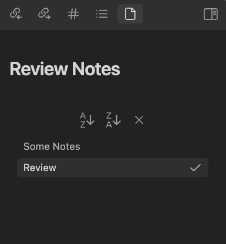

# Review Notes Plugin for Obsidian

This plugin shows newly created and recently updated files.

## Screenshot

## Usage

## Sorting Files

Newly created files and modifications to existing files are automatically added to the end of the list. To sort your files by name in ascending or descending order, follow these steps:

1. Click on the  button to sort files by ascending file name (A-Z).
2. Click on the  button to sort files by descending file name (Z-A).

## Clearing the List

To clear the entire list of files, click on the  button. Please note that this action is irreversible.
